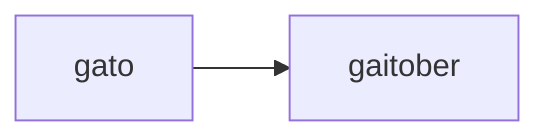
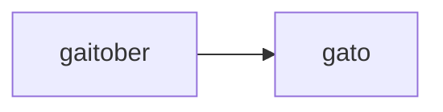

# ChallengeONE - Encriptador

Aplicación que codifica y decodifica mensajes en base a las siguientes reglas:

- La letra `e` es convertida en `enter`.
- La letra `i` es convertida en `imes`.
- La letra `a` es convertida en `ai`.
- La letra `o` es convertida en `ober`.
- La letra `u` es convertida en `ufat`.

## Ejemplo

